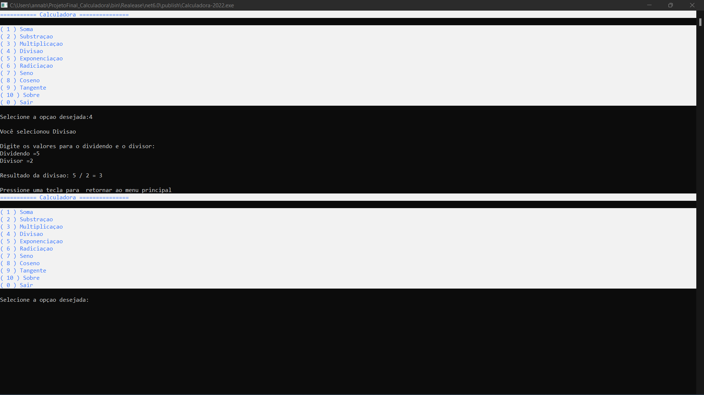

# Projeto_Calculadora

Este programa foi criado como projeto final da disciplina de Desenvolvedor C#. O software é uma calculadora contendo as quatro operações aritméticas básicas, potenciação, raiz quadrada, seno, coseno e tangente.


## Manual do usuário:
```
- Após baixar o programa, selecione a opção que deseja no menu principal.
- Após isso, digite o valor númerico para realizar a operação selecionada.
- Ao final, pressione alguma tecla para retornar ao menu principal.
```
### O que fazer em casos de erro?
```
- Caso uma menssagem de erro apareça, apenas pressione alguma tecla para ser direcionado ao menu principal novamente.
```
### Como sair do programa?
```
- Para sai do programa, vá para o menu inicial e selecione a opção (0).
```


## Programa em execucão!





## _Dowload_

Baixe o arquivo abaixo. Descompacte na pasta desejada.

[⬇️Dowload do arquivo .zip](dist/Projeto_Final.zip)

Execute utilizando o comando:

```
dotnet Calculadora-2022.dll
```
Ou, se estiver utilizando o Windows, será necessário apenas dar um duplo-clique no ícone do programa.


## Site do projeto

🔃Compartilhe o link do projeto!

[Link para acessar o site deste projeto](https://annarodrig.github.io/ProjetoFinal_Calculadora/)


## Agradecimentos

Agradeço aos meus professores Ermogenes e Diego Neri e a instituição de ensino Etec Adolpho Berezim, pela oportunidade de conhecer o mundo da programação e estudar sobre desenvolvimento de software! :) 

- [Etec Adolpho Berezim](https://eteab.com.br/cms/)
- [Prof.Ermogenes](https://github.com/ermogenes)
- [Prof.Neri](https://github.com/diegoneri)