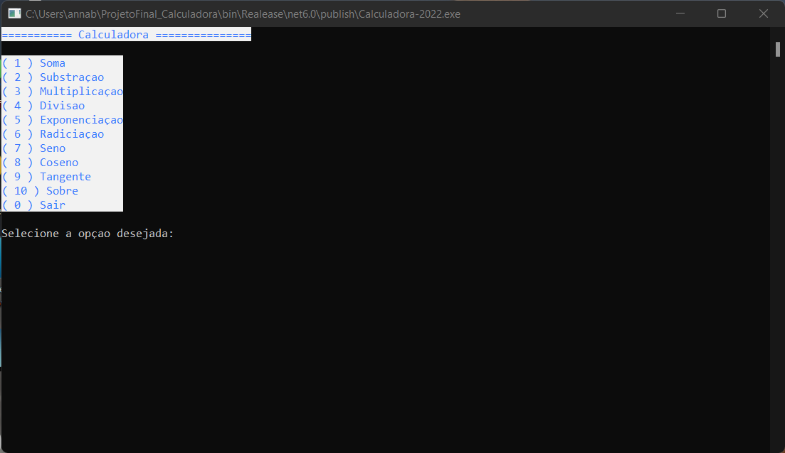

# Projeto_Calculadora

Este programa foi criado como projeto final da disciplina de Desenvolvedor C#. O software é uma calculadora contendo as quatro operações aritméticas básicas, potenciação, raiz quadrada, seno, coseno e tangente.


## _Screenchot_



## _Dowload_


Baixe o arquivo abaixo. Descompacte na pasta desejada.

[⬇️Dowload do arquivo .zip](dist/Projeto_Final.zip)

Execute utilizando o comando:

```
dotnet Calculadora-2022.dll
```
Ou, se estiver utilizando o Windows, será necessário apenas dar um duplo-clique no ícone do programa.

## Agradecimentos

Agradeço aos meus professores Ermogenes e Diego Neri e a instituição de ensino Etec Adolpho Berezim, pela oportunidade de conhecer o mundo da programação e estudar sobre desenvolvimento de software! :) 

- [Etec Adolpho Berezim](https://eteab.com.br/cms/)
- [Prof.Ermogenes](https://github.com/ermogenes)
- [Prof.Neri](https://github.com/diegoneri)